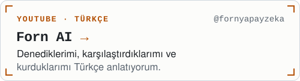

<picture>
  <source media="(prefers-color-scheme: dark)" srcset="assets/banner-dark.svg">
  
</picture>

  
  
  

Kodlama ajanları "bitti" demeyi çok seviyor. Ben de "göster" demeyi.

Claude Code ve Codex gibi ajanlarla çalışıyor, onların başında duracak araçlar yazıyorum:
hedefi netleştiren, işi bağımsız bir sınavdan geçiren, takılınca nedenini söyleyen araçlar.
Denediklerimi, karşılaştırdıklarımı ve kurduklarımı YouTube'da **[Forn AI](https://youtube.com/@fornyapayzeka)** kanalında anlatıyorum.

> I build tools around AI coding agents and talk about them (in Turkish) on [Forn AI](https://youtube.com/@fornyapayzeka).
> The common thread: an agent saying "done" is a claim, not proof.

## Öne çıkan: Orvant

<a href="https://github.com/fornhere/orvant">
  <picture>
    <source media="(prefers-color-scheme: dark)" srcset="assets/orvant-card-dark.svg">
    
  </picture>
</a>

Orvant, kodlama ajanının (Codex) başında operatör gibi çalışan bir Python motoru, CLI ve skill.
Hedefi sorularla netleştirir, onayladığın sözleşmeden bir plan çıkarır, iş başlamadan önce bağımsız
kabul sınavını (**kehanet**) hazırlar ve işi ancak o sınavdan geçerse kabul eder. Takılırsa nedenini
sınıflayıp bir sonraki adımı önerir; kullanıcıya yalnız gerçekten onun kararı olan soruları sormayı hedefler.

**Dürüst durum: 0.1.0b1, açık beta.** İlk kapsam küçük Python CLI'ları, veri otomasyonu ve dar kapsamlı
depo bakımı. Geniş otonom proje tamamlama ve kullanıcı emeğinde kazanç henüz kanıtlanmış değil.

Gereksinimler

Python 3.11+, Linux, Git ve kimliği doğrulanmış Codex CLI. MIT lisanslı.
Komutlar: <kbd>orvant karsila</kbd> <kbd>orvant mimar</kbd> <kbd>orvant yurut</kbd> <kbd>orvant surdur</kbd>

→ [github.com/fornhere/orvant](https://github.com/fornhere/orvant)

## Diğer projeler

  <a href="https://github.com/fornhere/hafiza-os"><picture><source media="(prefers-color-scheme: dark)" srcset="assets/card-hafiza-os-dark.svg"></picture></a>
  <a href="https://github.com/fornhere/claude-kurallar"><picture><source media="(prefers-color-scheme: dark)" srcset="assets/card-claude-kurallar-dark.svg"></picture></a>
  <a href="https://github.com/fornhere/sonnet-vs-astra-benchmark"><picture><source media="(prefers-color-scheme: dark)" srcset="assets/card-sonnet-vs-astra-benchmark-dark.svg"></picture></a>
  <a href="https://github.com/fornhere/opus55-demolar"><picture><source media="(prefers-color-scheme: dark)" srcset="assets/card-opus55-demolar-dark.svg"></picture></a>
  <a href="https://github.com/fornhere/jev-dersleri"><picture><source media="(prefers-color-scheme: dark)" srcset="assets/card-jev-dersleri-dark.svg"></picture></a>
  <a href="https://youtube.com/@fornyapayzeka"><picture><source media="(prefers-color-scheme: dark)" srcset="assets/card-forn-ai-dark.svg"></picture></a>

  

Ajan "bitti" der; kapı karar verir. · <a href="https://youtube.com/@fornyapayzeka">youtube.com/@fornyapayzeka</a>

