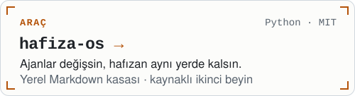
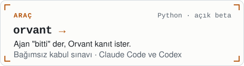
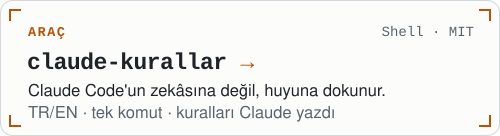
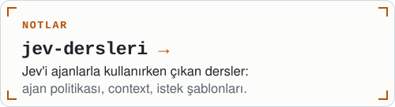
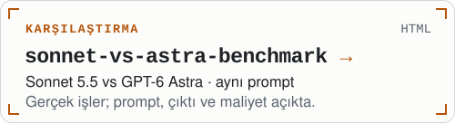
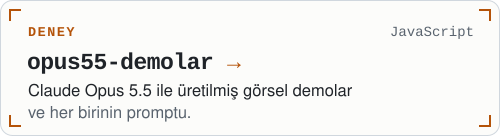

<picture>
  <source media="(prefers-color-scheme: dark)" srcset="assets/banner-dark.svg">
  
</picture>

  

[Forn AI](https://youtube.com/@fornyapayzeka) kanalında yapay zekâyla projeler geliştiriyor, kendi araçlarımı kuruyor ve modelleri gerçek işlerde test ediyorum.
Videolarda kullandığım araçlar, kurallar ve test verileri burada.

## Projeler

  <a href="https://github.com/fornhere/hafiza-os"><picture><source media="(prefers-color-scheme: dark)" srcset="assets/card-hafiza-os-dark.svg"></picture></a>
  <a href="https://github.com/fornhere/orvant"><picture><source media="(prefers-color-scheme: dark)" srcset="assets/card-orvant-dark.svg"></picture></a>
  <a href="https://github.com/fornhere/claude-kurallar"><picture><source media="(prefers-color-scheme: dark)" srcset="assets/card-claude-kurallar-dark.svg"></picture></a>
  <a href="https://github.com/fornhere/jev-dersleri"><picture><source media="(prefers-color-scheme: dark)" srcset="assets/card-jev-dersleri-dark.svg"></picture></a>
  <a href="https://github.com/fornhere/sonnet-vs-astra-benchmark"><picture><source media="(prefers-color-scheme: dark)" srcset="assets/card-sonnet-vs-astra-benchmark-dark.svg"></picture></a>
  <a href="https://github.com/fornhere/opus55-demolar"><picture><source media="(prefers-color-scheme: dark)" srcset="assets/card-opus55-demolar-dark.svg"></picture></a>

